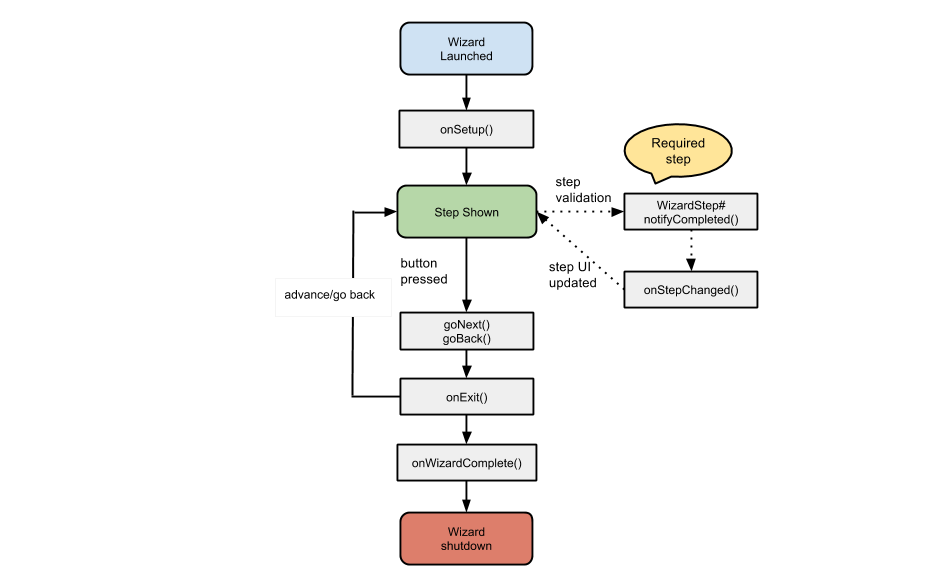

_Since v1.1.0_
_Modified v1.3.0_

It's possible to block users from proceeding to the next step until a certain rule is met. To do that, you need to configure the step as 'required' when constructing the wizard flow.
For more info on how to construct the wizard flow, please refer to the [Simple Wizard Tutorial](https://github.com/Nimrodda/WizarDroid/wiki/Simple-Wizard-Tutorial).
The example presented in this tutorial is included in `wizardroid-sample` project.

The following diagram shows the lifecycle of a wizard in WizarDroid:

WizarDroid handles dynamic wizard flow by defining each step as _required_ or _not required_. If a step is set _required_, by default it will be marked as _incomplete_.
In this case, WizarDroid will ignore any call to `goNext()`. Therefore, in order to signal WizarDroid that it's ok to proceed to the next step, you must call `notifyCompleted()` from within the step itself.
In this tutorial, I will guide you through the process by giving a simple example.

###1.	Setting the step as Required

When constructing the wizard flow, call `addStep(step class, true)`. This will tell WizarDroid that the step is required.
WizarDroid will regard this step as "incomplete" until you explicitly define the step as completed.

	@Override
	public WizardFlow onSetup() {
	    return new WizardFlow.Builder()
	            /*
	            Add your steps in the order you want them to appear and eventually call create()
	            to create the wizard flow.
	             */
	            .addStep(FormStep1.class)
	            /*
	            Mark this step as 'required', preventing the user from advancing to the next step
	            until a certain action is taken to mark this step as completed by calling WizardStep#notifyCompleted()
	            from the step.
	             */
	            .addStep(FormStep2.class, true)
	            .addStep(FormStep3.class)
	            .create();
	}

###2.    Signaling WizarDroid that the step is completed

Let's say we want to block the user from proceeding to the next step until a checkbox is ticked.
We add a checkbox to the layout as normal and in its OnCheckedChangeListener implementation, we call `notifyCompleted()` when the checkbox is marked,
and `notifyIncomplete()` when it's not.

	checkBox.setOnCheckedChangeListener(new CompoundButton.OnCheckedChangeListener() {
	    @Override
	    public void onCheckedChanged(CompoundButton buttonView, boolean isChecked) {
	        if (isChecked) {
	            //Notify that the step is completed
	            notifyCompleted();
	        }
	        else {
	            //Notify that the step is incomplete
	            notifyIncomplete();
	        }
	    }
	});

This in return, will enable/disable the 'Next' button when using the built in *BasicWizardLayout*. In case you are using your own [custom wizard layout](https://github.com/Nimrodda/WizarDroid/wiki/Creating-Custom-Wizard-Layout), `notifyCompleted()` will trigger the event `onStepChanged()`. In the built-in `BasicWizardLayout#onStepChanged()` will update the wizard controls accordingly.

	/**
	 * Event triggered after a step was changed, updating the button labels accordingly
	 */
	@Override
	public void onStepChanged() {
	    updateWizardControls();
	}

	/**
	 * Updates the UI according to current step position
	 */
	private void updateWizardControls() {
	    //Disable the back button in the first step
	    previousButton.setEnabled(!wizard.isFirstStep());

	    previousButton.setText(getBackButtonLabel());
	    //Disable the next button if the step is marked as 'required' and is incomplete
	    nextButton.setEnabled(wizard.canGoNext());

	    //Set different next button label based on the wizard position
	    nextButton.setText(wizard.isLastStep()
	            ? getFinishButtonText()
	            : getNextButtonLabel());
	}

You can easily build on top of this simple example if you have multiple form components you need to validate. For instance, you can have some logic which validates all form fields and if and only if validation for all fields is successful call `notifyCompleted()`.