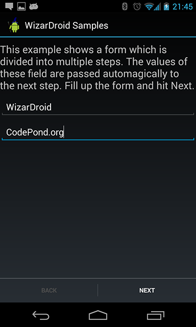

This tutorial demonstrates a form implemented in a couple of steps and WizarDroid built-in persistence via Reflection.

    * The source code for this tutorial is available on GitHub under wizardroid-sample folder

* Create a Fragment that inherits from **BasicWizardLayout** and override *onSetup()* to define the wizard's flow
* Set up the layout for each step (or reuse the same layout and dynamically modify its content)
* Create your Wizard's steps by inheriting from **WizardStep** and override *onExit(int exitCode)* to do some work before proceeding to the next step
* Annotate steps fields which you'd like WizarDroid to persist in its context with [@ContextVariable](WizarDroid-Context)

###1.	Inherting from BasicWizardLayout
Same as in [Simple Wizard Tutorial](Simple-Wizard-Tutorial#2---Inheriting-from-WizardFragment).

###2.	Steps Layout

**FormStep1**

In the first step we will have a simple form asking for the user's firstname and lastname:

	<LinearLayout xmlns:android="http://schemas.android.com/apk/res/android"
	              android:orientation="vertical"
	              android:layout_width="match_parent"
	              android:layout_height="match_parent">
	
	    <TextView
	            android:layout_width="match_parent"
	            android:layout_height="wrap_content"
	            android:id="@+id/textView"
	            android:text="@string/sample_form_text"
	            android:layout_marginTop="10dp"
	            android:textSize="20dp"/>
	    <EditText
	            android:layout_width="fill_parent"
	            android:layout_height="wrap_content"
	            android:id="@+id/firstnameField"
	            android:hint="@string/hint_firstname"
	            android:phoneNumber="false"
	            android:layout_marginTop="10dp"
	            android:singleLine="true"/>
	    <EditText
	            android:layout_width="fill_parent"
	            android:layout_height="wrap_content"
	            android:id="@+id/lastnameField"
	            android:hint="@string/hint_lastname"
	            android:layout_marginTop="10dp"
	            android:singleLine="true"/>
	</LinearLayout>

**FormStep2**

In the second and last step we will have a summary of the input from the previous step:

	<LinearLayout xmlns:android="http://schemas.android.com/apk/res/android"
	              android:orientation="vertical"
	              android:layout_width="match_parent"
	              android:layout_height="match_parent">
	
	    <TextView
	            android:layout_width="fill_parent"
	            android:layout_height="wrap_content"
	            android:id="@+id/form_summary"
	            android:text="@string/sample_form_summary"
	            android:textSize="20dp"
	            android:layout_marginTop="10dp"/>
	    <TextView
	            android:layout_width="fill_parent"
	            android:layout_height="wrap_content"
	            android:id="@+id/firstname"/>
	    <TextView
	            android:layout_width="fill_parent"
	            android:layout_height="wrap_content"
	            android:id="@+id/lastname"/>
	</LinearLayout>

###3.    Creating the steps by inheriting from WizardStep

**FormStep1**

	public class FormStep1 extends WizardStep {
	
	    /**
	     * Tell WizarDroid that these are context variables.
	     * These values will be automatically bound to any field annotated with {@link ContextVariable}.
	     * NOTE: Context Variable names are unique and therefore must
	     * have the same name wherever you wish to use them.
	     */
	    @ContextVariable
	    private String firstname;
	    @ContextVariable
	    private String lastname;
	
	    EditText firstnameEt;
	    EditText lastnameEt;
	
	    //You must have an empty constructor for every step
	    public FormStep1() {
	    }
	
	    //Set your layout here
	    @Override
	    public View onCreateView(LayoutInflater inflater, ViewGroup container,
	                             Bundle savedInstanceState) {
	        View v = inflater.inflate(R.layout.step_form, container, false);
	        //Get reference to the textboxes
	        firstnameEt = (EditText) v.findViewById(R.id.firstnameField);
	        lastnameEt = (EditText) v.findViewById(R.id.lastnameField);
	
	        //and set default values by using Context Variables
	        firstnameEt.setText(firstname);
	        lastnameEt.setText(lastname);
	
	        return v;
	    }
	
	    /**
	     * Called whenever the wizard proceeds to the next step or goes back to the previous step
	     */
	
	    @Override
	    public void onExit(int exitCode) {
	        switch (exitCode) {
	            case WizardStep.EXIT_NEXT:
	                bindDataFields();
	                break;
	            case WizardStep.EXIT_PREVIOUS:
	                //Do nothing...
	                break;
	        }
	    }
	
	    private void bindDataFields() {
	        //Do some work
	        //...
	        //The values of these fields will be automatically stored in the wizard context
	        //and will be populated in the next steps only if the same field names are used.
	        firstname = firstnameEt.getText().toString();
	        lastname = lastnameEt.getText().toString();
	    }
	}

By annotating a field with *@ContextVariable*, we tell WizarDroid that we want this field to be available also for the next steps. [Learn more](WizarDroid-Context) about passing data between steps. Next, we override *[onExit(int exitCode)](http://nimrodda.github.io/WizarDroid/javadoc/classorg_1_1codepond_1_1wizardroid_1_1_wizard_step.html#a00b9220238770ab5f9f9f6e49d4b67cd)* and depending on the *[exitCode](http://nimrodda.github.io/WizarDroid/javadoc/classorg_1_1codepond_1_1wizardroid_1_1_wizard_step.html#af27d3100ae63a48af4b7b110c4b29cdb)* we bind the input we received to the step's fields. 

**FormStep2**

In this step we will show a summary of the input we received in the previous step. **Notice** that the step field names **MUST** be the same as in the previous step in order for WizarDroid to populate the values for these fields.

	public class FormStep2 extends WizardStep {
	
	    /**
	     * Tell WizarDroid that these are context variables.
	     * These values will be automatically bound to any field annotated with {@link ContextVariable}.
	     * NOTE: Context Variable names are unique and therefore must
	     * have the same name wherever you wish to use them.
	     */
	    @ContextVariable
	    private String firstname;
	    @ContextVariable
	    private String lastname;
	
	
	    //You must have an empty constructor for every step
	    public FormStep2() {
	    }
	
	    //Set your layout here
	    @Override
	    public View onCreateView(LayoutInflater inflater, ViewGroup container,
	                             Bundle savedInstanceState) {
	        View v = inflater.inflate(R.layout.step_summary, container, false);
	        TextView firstnameTv = (TextView) v.findViewById(R.id.firstname);
	        TextView lastnameTv = (TextView) v.findViewById(R.id.lastname);
	
	        //WizarDroid will automatically inject the values for these fields
	        //so we can simply set the text views
	        firstnameTv.setText(firstname);
	        lastnameTv.setText(lastname);
	
	        return v;
	    }
	}

**That's it!** Run the application and see how it's working.
