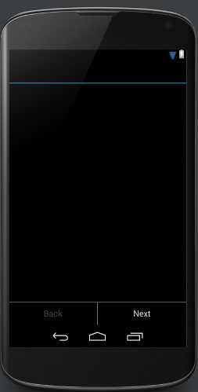

This tutorial demonstrates a simple case scenario where the wizard is only providing information in a couple of steps. WizarDroid comes with a basic built-in Wizard layout that can be used. The layout consists of two buttons, with default labels: 'Next' and 'Back' (configurable if needed) located at the bottom of the screen. See [Creating Custom Wizard Layout](Creating-Custom-Wizard-Layout) If you wish to create your own custom wizard layout.

    * The source code for this tutorial is available on GitHub under wizardroid-sample folder

* Create a [Fragment](http://developer.android.com/reference/android/app/Fragment.html) that inherits from [BasicWizardLayout](http://nimrodda.github.io/WizarDroid/javadoc/classorg_1_1codepond_1_1wizardroid_1_1layouts_1_1_basic_wizard_layout.html) and override *[onSetup()](http://nimrodda.github.io/WizarDroid/javadoc/classorg_1_1codepond_1_1wizardroid_1_1_wizard_fragment.html#a1cab74608d86fe37163d7465d2bda988)* to define the wizard's flow
* Set up the layout for each step (or reuse the same layout and dynamically modify its content)
* Create your Wizard's steps by inheriting from [WizardStep](http://nimrodda.github.io/WizarDroid/javadoc/classorg_1_1codepond_1_1wizardroid_1_1_wizard_step.html)
* Hook up the wizard to its host activity

###1.	Inheriting from BasicWizardLayout

	public class TutorialWizard extends BasicWizardLayout {
	
	    /**
	     * Note that initially BasicWizardLayout inherits from {@link android.support.v4.app.Fragment} and therefore you must have an empty constructor
	     */
	    public TutorialWizard() {
	        super();
	    }
	
	    //You must override this method and create a wizard flow by
	    //using WizardFlow.Builder as shown in this example
	    @Override
	    public WizardFlow onSetup() {
			/* Optionally, you can set different labels for the control buttons
	        setNextButtonLabel("Advance");
	        setBackButtonLabel("Return");
	        setFinishButtonLabel("Finalize"); */

	        return new WizardFlow.Builder()
	                .addStep(TutorialStep1.class)           //Add your steps in the order you want them
	                .addStep(TutorialStep2.class)           //to appear and eventually call create()
	                .create();                              //to create the wizard flow.
	    }
	}

Since we are using the built-in wizard layout, there is no need to handle *onClick()* event for the wizard control buttons. In this scenario we just display text without any input given from the user. Learn how to handle user input and persist it among steps in [this tutorial](Passing-data-among-steps-and-persisting-user-input).

#####1.A.    Buttons Labels

You can change the default buttons' labels by calling *[setNextButtonLabel(string)](http://nimrodda.github.io/WizarDroid/javadoc/classorg_1_1codepond_1_1wizardroid_1_1layouts_1_1_basic_wizard_layout.html#a3acee3cbc34bfa47f10dd39dc13d04d0)*, *[setBackButtonLabel(string)](http://nimrodda.github.io/WizarDroid/javadoc/classorg_1_1codepond_1_1wizardroid_1_1layouts_1_1_basic_wizard_layout.html#ab929c3ad3d788d6076f1665db8e89b70)*, *[setFinishButtonLabel(string)](http://nimrodda.github.io/WizarDroid/javadoc/classorg_1_1codepond_1_1wizardroid_1_1layouts_1_1_basic_wizard_layout.html#ae5e3666addff2d24d7ac32267b68429d)* in *[onSetup()](http://nimrodda.github.io/WizarDroid/javadoc/classorg_1_1codepond_1_1wizardroid_1_1_wizard_fragment.html#a1cab74608d86fe37163d7465d2bda988)*.

###2.	Steps Layout

For simplicity, we will re-use the same layout for all the steps and dynamically change its content.

	<LinearLayout xmlns:android="http://schemas.android.com/apk/res/android"
              android:orientation="vertical"
              android:layout_width="match_parent"
              android:layout_height="match_parent">

    <TextView
            android:layout_width="fill_parent"
            android:layout_height="wrap_content"
            android:id="@+id/textView"
            android:layout_marginTop="10dp"
            android:textSize="20dp"/>
    </LinearLayout>

###3.    Creating the steps by inheriting from WizardStep

**TutorialStep1**

	public class TutorialStep1 extends WizardStep {

        //Wire the layout to the step
        public TutorialStep1() {
        }
    
         //Set your layout here
        @Override
        public View onCreateView(LayoutInflater inflater, ViewGroup container,
            Bundle savedInstanceState) {
            View v = inflater.inflate(R.layout.step_tutorial, container, false);
            TextView tv = (TextView) v.findViewById(R.id.textView);
            tv.setText("This is an example of Step 1 in the wizard. Press the Next " +
                       "button to proceed to the next step. Hit the back button to go back to the calling activity.");
    
            return v;
        }
    }

**TutorialStep2**

	public class TutorialStep2 extends WizardStep {
	
	    //You must have an empty constructor for every step
	    public TutorialStep2() {
	    }
	
	    //Set your layout here
	    @Override
	    public View onCreateView(LayoutInflater inflater, ViewGroup container,
	                             Bundle savedInstanceState) {
	        View v = inflater.inflate(R.layout.step_tutorial, container, false);
	        TextView tv = (TextView) v.findViewById(R.id.textView);
	        tv.setText("This is an example of Step 2 and also the last step in this wizard. " +
	                "By pressing Finish you will conclude this wizard and go back to the main activity." +
	                "Hit the back button to go back to the previous step.");
	        return v;
	    }
	}

###4.	Hook up the wizard to its host activity
	
**IMPORTANT:** The activity MUST inherit from [FragmentActivity](http://developer.android.com/reference/android/support/v4/app/FragmentActivity.html) or its child classes! Otherwise, you will get the following exception when starting the activity: `android.view.InflateException: Binary XML file line #5: Error inflating class fragment`.

	public class TutorialActivity extends FragmentActivity {
	
	    @Override
	    public void onCreate(Bundle savedInstanceState) {
	        super.onCreate(savedInstanceState);
	        setContentView(R.layout.activity_tutorial);
	    }
	}

And the activity's layout:

	<FrameLayout xmlns:android="http://schemas.android.com/apk/res/android"
	    android:orientation="vertical"
	    android:layout_width="fill_parent"
	    android:layout_height="fill_parent">
	
	    <fragment
	        android:id="@+id/tutorial_wizard_fragment"
	        android:layout_width="match_parent"
	        android:layout_height="wrap_content"
	        android:name="org.codepond.wizardroid.sample.wizards.TutorialWizard" />
	</FrameLayout>

**That's it!** Run the application and see how it's working.

This is just a very basic example of what you can do with WizarDroid.
Carry on to the [next tutorial](Passing-data-among-steps-and-persisting-user-input) to learn. how you can create a form in multiple steps while WizarDroid handles persistence in the background.
